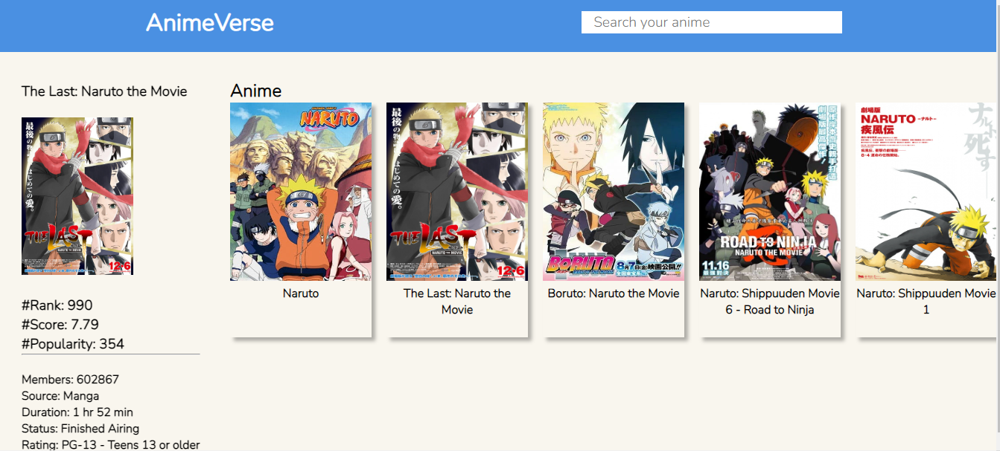

# AnimeVerse App

AnimeVerse App is a web application that allows you to search and view information about your favorite animes. It utilizes the Jikan Moe API to retrieve details about animes, including titles, synopses, and rankings.

## Features

- Search animes by name.
- View detailed information about each anime.
- Add your favorite animes to a personal list.
- Remove animes from your personal list.

## Technologies Used

- React for the frontend.
- Node.js for the backend.
- Jikan Moe API to fetch information about animes.

## Installation and Usage

1. Clone this repository.

```bash
git clone https://https://github.com/Butria/AnimeVerse.git

Screenshots



Contributions
Contributions are welcome! If you find any bugs or have any improvements, please create an issue or submit a pull request.